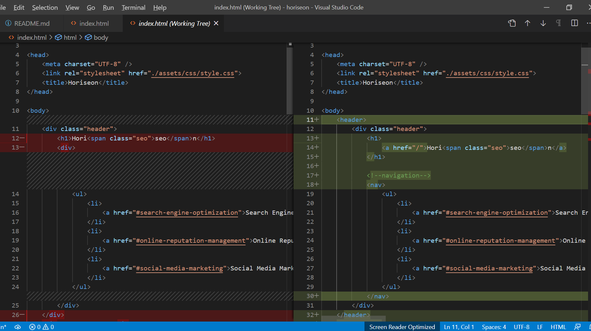

# Code Refactor Starter Code

## Accessibility changes

 ### Header
 
    * header element added as it was missing - eliminated the header class as it was redundant and updated css corresponding css selectors
    * navigation bar changed from being contained in a 
 container to a <nav> container - updated corresponding CSS
    * Implemented best practise with make the branding in the <header> of the page clickable to take the user back to the homepage

### Body

#### Hero
    * changed 
 meant to contain the hero section to <section> for best practise, less use of 
, and accessibility

#### Search Engine Optimization Section
    * changed 
 meant to contain the hero section to <section> for best practise, less use of 
, and accessibility
    * missing "id" element in the section container to allow the navigation bar to direct to this section
    * Included an "alt" attribute describing the section image for screen reader accessibility
    * Changed section class from "search-engine-optimization" to "content-section" and did similar change to the other two sections to apply the same stlying with less code

#### Online Reputation Management
    * changed 
 meant to contain the hero section to <section> for best practise, less use of 
, and accessibility
    * Included an "alt" attribute describing the section image for screen reader accessibility

#### Social Media Marketing
    * changed 
 meant to contain the hero section to <section> for best practise, less use of 
, and accessibility
    * Included an "alt" attribute describing the section image for screen reader accessibility

#### Benefit Section
    * Included section heading "Benefits" and gave its own css stlying class
    * Eliminated div classes "benefit-brand" and "benefit-cost" as they provide exactly the same sylting as the Div class "benefit-lead", so used "benefit-lead" to replace them.
    * Gave each image in this section an empty "alt" attributes as they are simply decorative

### Footer
    *Footer element added, eliminated the div with class of fotter and updated corresponding CSS selector

### CSS
    * Added comments to break up sections to comply with Scout Rule